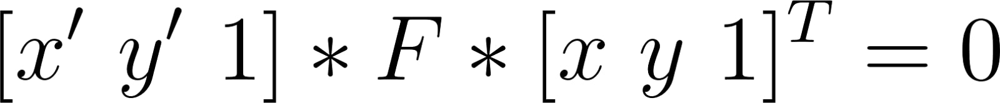
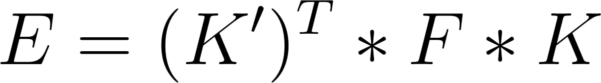
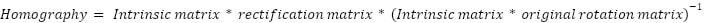
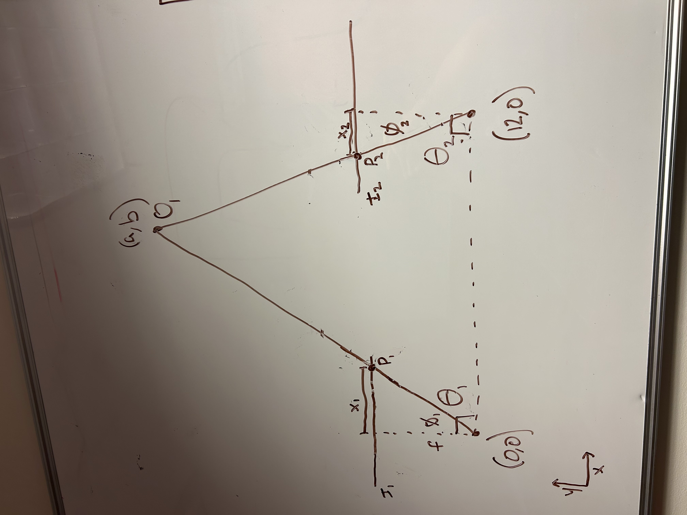
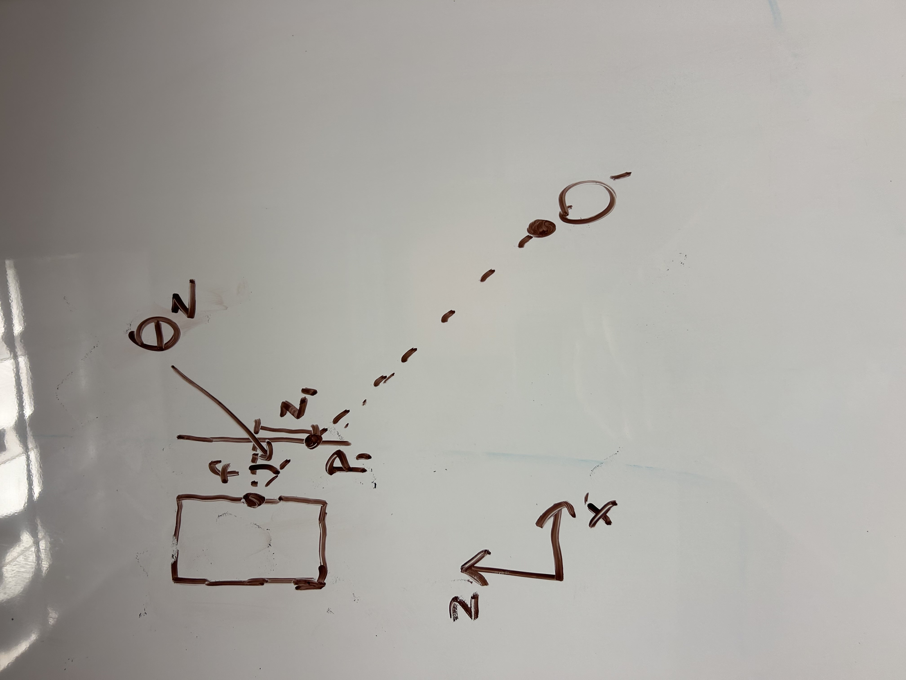
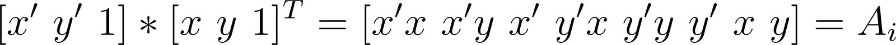
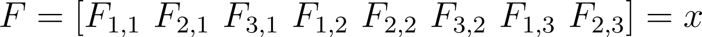
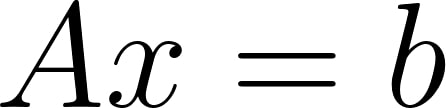

# stereo_vision

**What was the goal of your project?**

This project aimed to implement a stereo vision disparity map pipeline in Python using the OpenCV framework while computing most of the fundamental algorithms by hand. This included:

* Extracting the fundamental/essential matrices through the eight-point algorithm
* Rectifying the left and right images
* Constructing the disparity map

This codebase is organized into three independent files that can each be run separately for these three stages in the pipeline. Each file when run independently will run in debug mode and when run from another script will default to a suppressed mode:

* eight_point_algorithm.py
* image_rectificationV2.py
* disparity_map_NCC_with_GUI.py

This report will discuss the following topics of interest:

* The camera calibration pipeline. Picking the correct images, calculating the matrices with the eight-point algorithm, differences between OpenCV implementations and custom implementations, and differences between Windows and Linux OpenCV implementations.
* The image rectification pipeline. Using epipolar geometry to construct a homography, challenges, and results.
* The disparity map pipeline. NCC and SSD weighting approaches, vectorization, edge filtering, median vs gaussian blurring, and potential areas for improvement.
* Depth map calculation from disparity map

**How did you solve the problem? **

Eight-Point Algorithm:

The eight-point algorithm is one of the algorithms for estimating the fundamental matrix of a stereo vision system. The fundamental matrix is a matrix that represents the epipolar transformation between points in the undistorted left and right images. That is, the fundamental matrix maps points in either image to the same virtual y-value so that the disparity can be calculated based on the difference in the x-values. 

As implied by the name, the eight-point algorithm requires eight corresponding points across the two images. These were obtained from the chessboard calibration target for simplicity. Unlike the similar five-point and seven-point estimations, the eight-point algorithm can define the fundamental matrix up to a scalar, which simplifies the process and eliminates the possibility of estimation uncertainty. The fundamental matrix is defined by the following:

This equation can be solved for the eight points and eight values in the fundamental matrix directly. The ninth value F3,3 is conventionally set to 1 in order to lock the scale of the matrix.

While the fundamental matrix can be defined from a single set of images, the essential matrix should not. The essential matrix is defined as:

The essential matrix takes into account the distortions in the image using the intrinsic matrices K. OpenCV allows for the computation of the intrinsic matrix of a camera using built-in functions, however, for the purposes of calibrating the tangential and radial distortion, it is important to average a variety of different calibration poses in different corners of the image, at different angles, and at different distances. We decided to use eight images per camera, which in hindsight, is likely on the lower bound of acceptable calibration error. 

Image Rectification:

Image rectification parallelizes** **the epipolar lines of the two images making it easier to match key points between both images. Before a disparity map is calculated between two stereo images, it’s standard practice to rectify both independent images to simplify point matching in the disparity map. We decided to implement this in our pipeline in order to reduce the runtime of the disparity map and improve the likelihood that point will be matched correctly. 

Our image rectification code starts by decomposing the essential matrix as well as the rotation matrix received from the eight point algorithm. The information stored in this matrix tells the program where the cameras are in relation to each other. We wanted to use epipolar geometry to calculate the relationship between both images and compute the homographies that will be applied to the images to align them on the same plane. The common plane needed a new coordinate system we had to define. The x-axis (r1) for the new orthonormal bases was defined as the vector between the centers of both images. Based on this the y axis (r2) could be calculated to be the cross product of the x axis (r1) and the “world x axis” [0,0,1]. The z-axis (r3) was then defined as the cross product between the x axis (r1) and the y axis (r2) This coordinate system could then be stacked into a rotation matrix which would rotate the coordinate of the image to align with it. This could then be used to compute the homographies for each photo by taking the intrinsic matrix of the camera and normalizing the camera coordinates by multiplying it by the inverse of the transformations that map 3D world points into the original camera views. It was then multiplied by the rectification matrix to apply the new coordinate system which results in that photo’s homography. Reference the equation below. 

From here the homographies are applied to the initial images to rectify them and they are then ready to be used to calculate the disparity map. 

Disparity/Depth Mapping:

The algorithm we used to calculate a disparity map from our rectified left and right images was a modified window-based SSD pixel correlation algorithm. After converting the rectified images to grayscale, the algorithm captures a “window” around every pixel in each image, which contains the lightness value of every pixel within a specified distance of the primary pixel. Then, for each pixel in the left image, the pixel’s window is “matched” with the window of every pixel in the same row in the right image. Each match is given a similarity score, which is calculated based on the sum of squared differences (SSD) of every corresponding matrix entry. The closest pixel match is then found, and the disparity between the x-position of the left pixel and the x-position of its corresponding right pixel is input into the disparity map. By performing this operation for each pixel, the full disparity map can be calculated.

We made a couple modifications to this algorithm to help improve our results on real-world images, which were much more difficult to get good results from than our test images. The biggest change we made is implementing Canny edge detection on the rectified images and then only looking at edges for our pixel correlation, filling the rest of the area in with gradients between edges. We also tried to reduce noise by getting rid of outliers, which we determined by finding the mean disparity across the entire image and eliminating points that were more than one standard deviation outside of the mean.

Once we have calculated our disparity map, we can then use the left and right pixel values to calculate our depth map. A visual demonstration of how this works is shown below.

In the image above, *P1 *and *P2* represent the pixels from the left and right image, respectively, that have been determined to be of the same object. The variable *f* represents the focal length of the camera (in pixels), and *I1 *and* I2 *represent the image planes of the left and right image, with their width (in pixels) determined by the resolution of the image.

As we can see, the lines from the focal point of each camera through *P1 *and *P2* intersect at a point in space. In addition, we can determine the length of *x1* and *x2*, in units of pixels, given the width and height of our image in pixels and the pixel values of *P1 *and *P2*. From these values, we can then use basic geometry to calculate our angles Θ1 and Θ2, and therefore determine the point in our plane (a,b) where the object is located. 

We then have one final step. So far, we have been looking at this problem in 2D, but with a real camera, we must also account for the vertical position of our pixel and its deviation from the focal point of the camera. A visualization of this is shown below.

This problem is very similar to the problem we just had, except much simpler because we already know the position of O1 within its epipolar plane. In order to figure out how to transform it into 3D space, we must simply calculate Θz with the same methodology we used previously, and then perform a basic coordinate transform to find the true x, y, and z coordinates of the object.

**Describe a design decision you had to make when working on your project and what you ultimately did (and why)?**

Eight-Point Algorithm:

In implementing the eight-point algorithm, we decided to vectorize the approach. This required taking an interesting perspective to the linear system for solving the fundamental matrix. By first processing the multiplication of the point vectors, the result could be unrolled to form a row of an 8x8 matrix, excluding the final 1 caused by the point homogeneity. We will call this matrix A.

By unrolling the fundamental matrix, the following 8x1 vector can be formed, excluding F3,3 in order to not over define the system. We will call this vector x.

Finally, we will set the solution to the system of equations to be a vector of size 8x1 filled with -1, which we will call b. This final equation can be solved for the fundamental matrix in a vectorized manner.

Image Rectification: 

Image rectification is a common practice that many forms of computer vision use and therefore there are many tools available on platforms like open cv that perform this automatically. We chose to write the epipolar geometry out ourselves in order to gain a firmer understanding of the math behind a stereo camera, and how to manipulate images in python, while still reducing the computational cost of calculating the disparity map. 

Disparity/Depth Mapping:

One major design decision we made in this section was the decision to implement edge detection and perform our pixel correlation purely on edges when calculating our disparity map. We made this decision when we started testing our disparity map on images from the ZED camera as opposed to training images. The ZED images posed much more of a challenge compared to the training images, as the training images comparatively had very little variety of depth and had a very textured background, which made window-based pixel correlation much easier. Detecting only edges allowed us to focus on the parts of our image that we could effectively correlate, which improved our results. 

**What if any challenges did you face along the way?**

Eight-Point Algorithm:

OpenCV has a lot of useful in-built algorithms for computing things like essential and fundamental matrices, however, the documentation is generally hard to follow to understand how the internals work. When implementing the fundamental matrix, it was found that the default settings for the RANSAC method were far too relaxed to result in a reasonable result and that forcing an analytical result with the eight-point flag would instead lead to a result similar to the custom algorithm.

On the other hand, the essential matrix computed by OpenCV was not able to be matched to the custom algorithm. This was despite trying to distort/undistort the input points, normalization with the focal length and focal position from the intrinsic matrices, and many other attempts. This matrix was not able to be reconciled with the extraction of the rotation and translation components, the former being entirely incorrect in both orientation and magnitude. This discrepancy seems to come from the OpenCV algorithm using the Nister 2004 paper [An Efficient Solution to the Five-Point Relative Pose Problem](https://www-users.cse.umn.edu/~hspark/CSci5980/nister.pdf). Other individuals have reported confusing behavior from this function, particularly with coplanar points, which is what we are using. It can be assumed that this algorithm’s approximation may be strong in most cases, but in situations like this it may not be applicable. Despite the paper claiming that it will work with coplanar points, the OpenCV implementation may have an issue.

Image Rectification:

Using a mathematical base for the image rectification code meant that there was minimal debugging beyond ensuring that the correct variables were referenced correctly. The code was however challenging to test because the images looked so similar pre and post rectification that it was difficult to tell if the rectification was working. We were able to solve this by displaying the original image above the rectified image placing our cursor on a distinct part of the original photo. We could then see if the y coordinates of our cursor matched the y coordinates of the rectified image. By doing this we were able to see the slight warping the image rectification was applying to the image and confirm that it was working as intended. 

Disparity/Depth Mapping:

The first major challenge we faced in this section was that correlating pixels is very computationally intensive, due to the fact that our images each contained hundreds of thousands of pixels. The first iteration of the pixel correlation algorithm, which used nested for loops for iteration, took about 2 and a half minutes to run. In order to solve this problem, we pre-calculated every pixel’s window and then simply vectorized the comparisons between each pixel and all the relevant pixels in the corresponding image. This allows the following block of code to be run:

 \
ncc = calculate_SSD(left_kernels[:, np.newaxis], right_pixel_kernel_matrix[y, img_right_edges[y, frame_thickness:-frame_thickness]])

This line takes advantage of NumPy’s broadcasting feature, which “broadcasts” smaller dimensions of arrays across larger arrays, giving them compatible shapes. In this example, when calculations are performed between the column vector left_kernels and the row vector right_pixel_kernel_matrix[y, img_right_edges[y, frame_thickness:-frame_thickness]], the output is a 2D matrix where the entries of the column vector are broadcast across all columns and the entries of the row vector are broadcast across all the rows. This allows the looping of our calculations to be performed in C instead of python, and reduces the runtime by approximately 95%. 

The next challenge we faced was when we started using images from the ZED camera instead of test images, our disparity map completely fell apart. As mentioned above, we decided to focus only on correlating edges to more effectively deal with the uncertainty caused by large swaths of featureless space in our images. This improved the quality of our disparity map, but still had significant drawbacks. 

The final and most difficult challenge that we faced was the presence of noise. All of our disparity maps, even the ones on standardized test images, were extremely noisy. We tried several methods to deal with this noise.

The first method we tried to deal with noise was introducing blurs into the image. We tried median blurring, Gaussian blurring, and bilateral filtering, and found that median blur by far was the most effective, as we typically had a good enough data-to-noise ratio that the median was an effective measurement and completely ignoring noisy pixels improved our map quality significantly.

The second method we tried was using normalized-cross correlation (NCC) instead of our sum of squared differences method for matching pixels across images. The tradeoff with NCC was that it was supposedly more accurate across varied lighting conditions, but was more computationally expensive ([University of Florence](https://www.micc.unifi.it/delbimbo/wp-content/uploads/2013/11/A33_Matching.pdf)), but we found that it did not noticeably improve our noise problem, so we continued with SSD matching. 

The third noise reduction method we tried was getting rid of outlier values. We did this by taking a “line of best fit”, representing every pixel having the exact same disparity, calculated the mean distance from this line, and then removed all outliers (as determined by having a value more than one standard deviation away from the mean). This provided a slight improvement to our disparity map. However, even after all these trials, our disparity map still had significant noise and could not be used effectively in any real-world stereo vision applications, which was likely due to the limitations of our somewhat rudimentary algorithm. 

**What would you do to improve your project if you had more time?**

Eight-Point Algorithm:

If we had more time, we would hope to run some more tests on the number of calibration images versus the resultant convergence of the intrinsic matrices. We would also be interested in implementing algorithms like the chessboard corner detection and intrinsic matrix calculations ourselves from scratch. There is not much to improve on the current performance of the eight-point algorithm implemented, except perhaps understanding why there exist very small differences between its result and that of the OpenCV implementation.

Finally, the project only runs successfully on Windows. For some reason, the function for finding calibration chessboards on Linux exhibits different behavior and does not detect the chessboards. If we had more time, it would be interesting to find the difference and how to make it work on both platforms.

Image Rectification:

Using the ZED allowed us to capture images that were already aligned for stereo vision applications. This minimized the need for image rectification; however, if our two images were taken with separate cameras, possibly at separate locations, this would have stretched the need for image rectification and could present challenges that would force us to strengthen our program. In an extension of this project, it would have been interesting to test with images that were not intended for stereo vision and create a program that can align these images for the eventual purpose of creating a depth map.

Disparity/Depth Mapping:

If we had more time, we would like to try to implement more advanced stereo matching techniques, such as graph cut optimization or loopy belief propagation. Implementing one (or multiple) of these techniques would likely give us a much more effective disparity map and potentially give us the ability to calculate accurate useful 3D depth maps. 

**Did you learn any interesting lessons for future robotic programming projects?**

Over the course of the project we explored how computer vision works and its limitations, how to write code that will reduce computational cost, the importance of debugging and how to use libraries to further our learning. Going forward, Mia will keep in mind the computational cost of image processing and find clever ways to simplify her machine vision code in PIE so that it all runs on a Raspberry Pi. Ari will build in debug options from the ground up because he found it  really annoying to add debug toggling to all the functions at the end and Will will leverage existing libraries when relevant to improve productivity and development speed.
